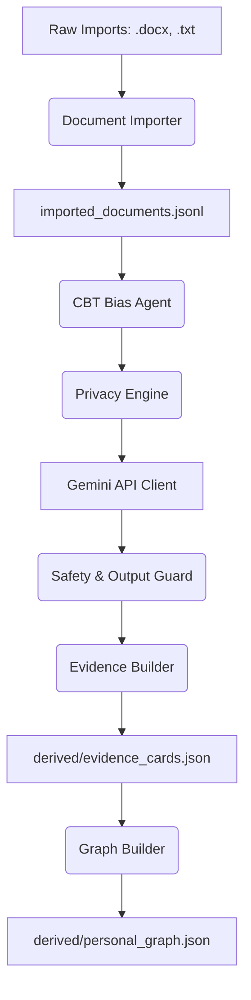

<!--
  Copyright (c) 2026 MyCompany LLC

  Licensed under the Apache License, Version 2.0 (the "License");
  you may not use this file except in compliance with the License.
  You may obtain a copy of the License at

      http://www.apache.org/licenses/LICENSE-2.0

  Unless required by applicable law or agreed to in writing, software
  distributed under the License is distributed on an "AS IS" BASIS,
  WITHOUT WARRANTIES OR CONDITIONS OF ANY KIND, either express or implied.
  See the License for the specific language governing permissions and
  limitations under the License.
-->

# Technical Specification - SelfMap Agent

## 1. System Architecture

The following diagram illustrates the flow of information through the SelfMap Agent:

## 2. File Roles & Descriptions

### Code Modules (`app/`)
- `cli.py`: Entrypoint CLI exposing commands for ingestion, analysis, graph updates, and interaction.
- `schemas.py`: Core Pydantic classes representing entities and JSON validation rules.
- `document_importer.py`: Handler for importing raw user journal documents.
- `privacy.py`: Scrubbing function for personal details (names, addresses, phones).
- `gemini_client.py`: Configuration and standard wrapper for Gemini APIs.
- `cbt_bias_agent.py`: Identifies cognitive distortions in automatic thoughts.
- `evidence_builder.py`: Validates evidence cards from memory events.
- `graph_builder.py`: Updates the DAG representing the belief network.
- `reflection.py`: Reconciles beliefs when contradictory evidence is recorded.

### Data Store Files (`data/`)
- `cbt_cards.json`: Initial set of cognitive distortions.
- `seed_memories.readonly.json`: Base memories for sandbox execution.
- `memory_events.jsonl`: Event logging for belief changes.

## 3. Memory Isolation & Data Safety

To safeguard user data and prevent contamination, the system segments data loading and retrieval based on three modes configured via `SELFMAP_MODE`:

1. **`demo` Mode**:
   - `profile_id` is restricted to `"demo_user"`.
   - Only `data/seed_memories.readonly.json` is loaded.
2. **`user` Mode**:
   - `profile_id` is derived from `ACTIVE_PROFILE_ID`.
   - `data/seed_memories.readonly.json` is explicitly ignored.
   - Only profile-scoped user events and imports are loaded.
3. **`mixed_demo` Mode**:
   - Both seed memories (`demo_user`) and user events are loaded.
   - Scopes are preserved via individual card and entry metadata (`profile_id`, `source_type`, `source_id`).

> [!WARNING]
> **Data Segregation Policy:**
> Synthetic seed memories (`seed_memories.readonly.json`) are for demonstration and evaluation runs only. They must not be treated as real user data or mixed with real user profiles in standard operation.

